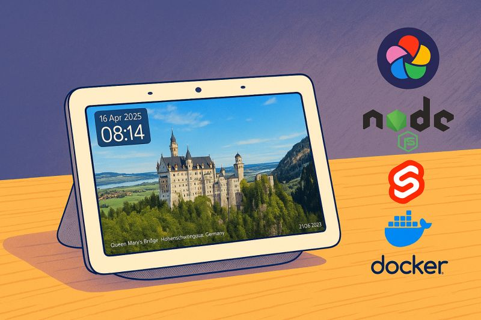

# immich-cast

A custom photo slideshow for Google Nest Hub (or any Chromecast device) that pulls images from your [Immich](https://immich.app/) library.

Built out of frustration with the default Nest Hub photo gallery — no location info, no dates, repetitive rotation that skips most of your library, and voice commands that Google quietly killed.

<p align="center">
  
</p>

## What it does

- Displays random photos from your Immich library on a Chromecast device
- Shows **"N years ago"** memories — photos taken on this day in previous years, mixed naturally into the slideshow
- Overlays **location** (reverse-geocoded from EXIF coordinates via OpenStreetMap), **date**, and **photo owner**
- Optional **weather widget** — temperature, wind, AQI, humidity, pressure (via IQAir)
- **Auto-casts** when the device goes idle, stops outside configured hours
- Tap a photo to **archive** it directly from the slideshow (per-user Immich API keys)
- Pairs portrait photos **side by side** automatically
- Tracks 10,000 recently shown images to avoid repeats
- Swipe or use arrow keys to navigate

## How it works

The app has two parts:

**API server** (Bun + Fastify) — fetches random images and memories from Immich, serves them as slides, handles weather/location lookups, and manages the Chromecast connection via the castv2 protocol.

**Frontend** (Svelte + Tailwind) — the actual slideshow UI that runs on the Chromecast. Auto-advances slides, lazy-loads images, handles touch/keyboard input.

The Chromecast integration was the tricky part. The castv2 protocol is poorly documented, and Chromecast kills inactive apps after ~10 minutes. The monitor polls the device every 5 seconds, detects idle state, relaunches the app, and sends the URL to load. Outside configured hours, it backs off to polling every 60 seconds.

## Setup

### Prerequisites

- A running [Immich](https://immich.app/) instance
- A Chromecast-enabled device on the same network
- Docker (for production) or [Bun](https://bun.sh) 1+ (for development)

### Configuration

Copy `.env.example` to `.env` and fill in your values:

```env
# Required
IMMICH_API_KEY=your_api_key              # Immich API key (Settings → API Keys)
IMMICH_API_URL=http://192.168.1.10:2283/api
CHROMECAST_IP=192.168.1.20               # Your Chromecast device IP
CAST_URL=http://192.168.1.30:2284        # URL where this app is reachable by the Chromecast

# Schedule (24h format)
START_HOUR=7                             # Start casting at 7am
END_HOUR=22                              # Stop at 10pm

# Optional
PORT=2284                                # Server port (default: 2284)
SLIDE_INTERVAL=30000                     # Slide duration in ms (default: 30s)
MEMORY_PERCENTAGE=20                      # Share of "N years ago" memory slides (default: 20% = every 5th); 0 disables
IMMICH_OWNERS_API_KEYS=uuid1=key1,uuid2=key2  # Per-user keys for archiving

# Weather (disabled by default)
WEATHER_ENABLED=true
IQAIR_CITY_ID=your_city_id              # Find yours on airvisual.com
WEATHER_REFRESH_INTERVAL=60000           # Refresh interval in ms
```

### Docker

```bash
docker compose up -d
```

Edit `TZ` in `docker-compose.yml` to your timezone (defaults to `America/Edmonton`). The container reads `.env` for the rest of the config.

### Deploying to a homelab

`deploy.sh` rsyncs the source to a remote host over SSH and recreates the Docker container there. Configure it once by copying `.env.deploy.example` to `.env.deploy`:

```bash
cp .env.deploy.example .env.deploy
# edit HOMELAB_HOST and HOMELAB_PATH
```

Then copy your `.env` to the remote (one-time) and run the deploy:

```bash
scp .env "$HOMELAB_HOST:$HOMELAB_PATH/.env"
./deploy.sh
```

The variables can also be passed inline (`HOMELAB_HOST=... HOMELAB_PATH=... ./deploy.sh`) if you prefer not to keep a file. Passwordless SSH (key-based auth) and Docker installed on the remote are assumed.

### Development

```bash
bun install
cp .env.example .env   # edit with your values
bun start              # runs API + Vite dev server concurrently
```

The API server watches for changes and auto-restarts. The Vite dev server hot-reloads the frontend.

## Tech stack

Svelte 5, Tailwind CSS 4, Vite, Fastify, TypeScript, castv2, dayjs, OpenStreetMap Nominatim API

## License

MIT
